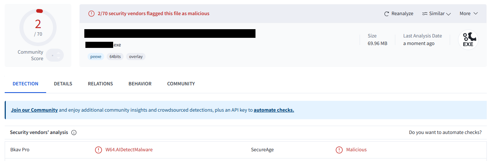
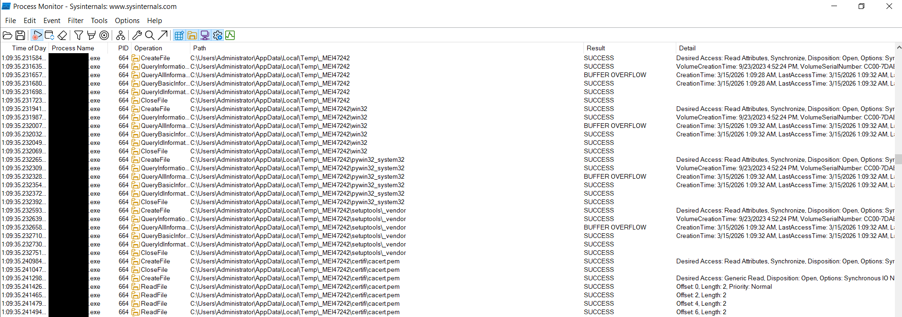
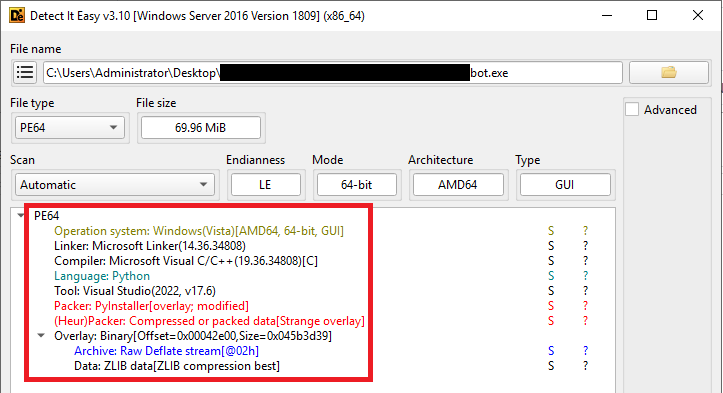
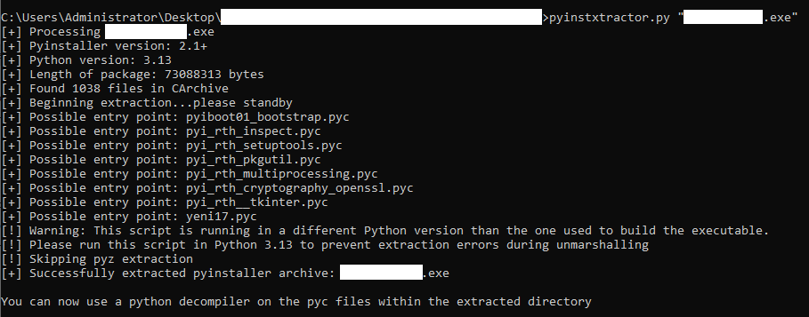
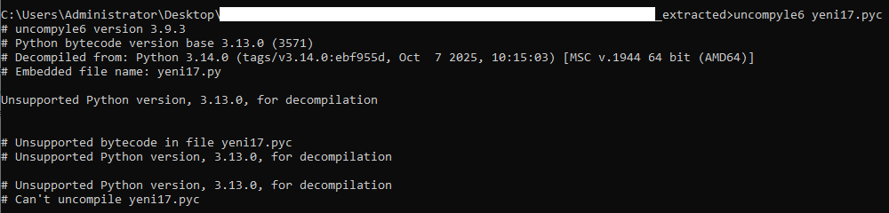
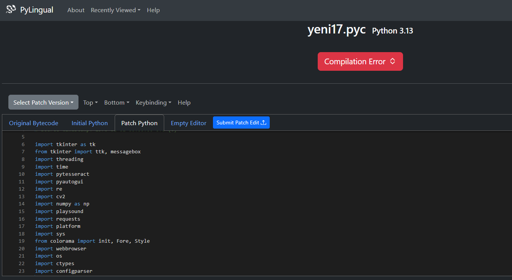
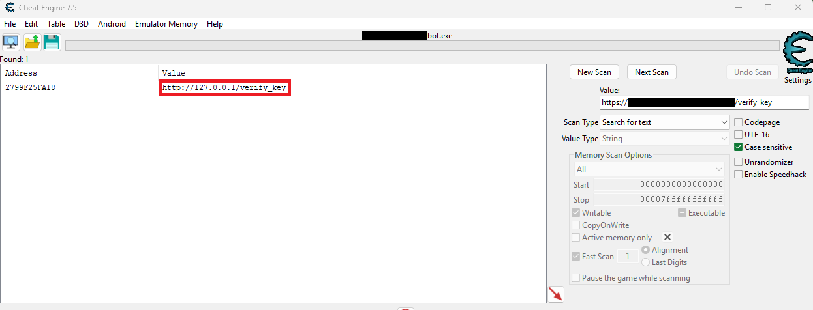
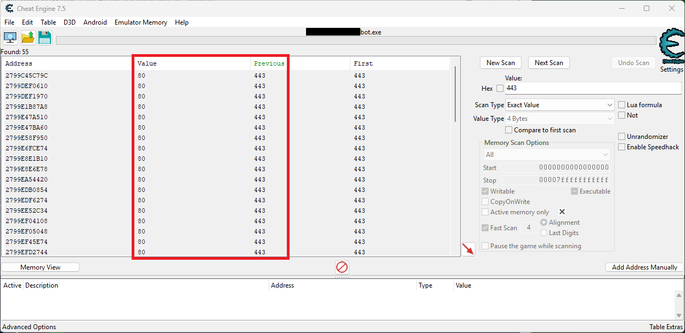
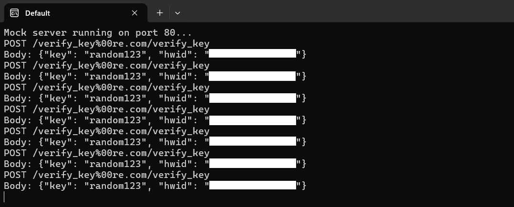

# Reverse Engineering a Gaming Bot License System
### How Curiosity Turned Into a Reverse Engineering Case Study

**Project Type:** Reverse Engineering Case Study  
**Focus Areas:** Software Security, Binary Analysis, License Validation  
**Techniques:** Static Analysis, Dynamic Analysis, Runtime Memory Manipulation

---

## TL;DR

I came across a commercial gaming bot that charged **$15/month for a license key**. Naturally, I got curious about how the licensing system actually worked.

After unpacking the executable, extracting its Python bytecode, and analyzing the license verification logic, I discovered a critical flaw: the client blindly trusted the server's response.

By redirecting the bot's license requests to a mock server that always returned a valid response, the bot unlocked itself.

This project became a reverse engineering exercise involving PyInstaller unpacking, Python bytecode decompilation, runtime memory manipulation, and network analysis.

---

# Introduction

Every once in a while, something on the internet pokes at your curiosity.

While browsing gaming forums one evening, I noticed several posts advertising a **"$15/month bot that plays the game for you."** The post included a download link to an executable and instructions for activating the license.

My first thought wasn’t *“I should use this.”*

It was:

> *How does something like this actually work under the hood?*

How does the bot verify a license?  
Where does it check?  
What prevents someone from bypassing it?

Those questions were enough to send me down the rabbit hole.

This write-up documents that journey — from safely analyzing the executable to identifying a fundamental weakness in its license validation system.

---

# Analysis Environment

Whenever you're dealing with unknown executables, safety comes first.

All analysis was performed inside an **isolated virtual machine** running **Windows 11** on  
[VMware Workstation Pro](https://www.vmware.com/products/workstation-pro.html).

Using a virtual machine ensures that if the executable turns out to be malicious, it cannot affect the host system.

### Tools Used

| Category | Tools |
|--------|------|
| Static Analysis | [Detect-It-Easy](https://github.com/horsicq/Detect-It-Easy/) |
| Dynamic Analysis | [Cheat Engine](https://www.cheatengine.org/), [Sysinternals Procmon](https://learn.microsoft.com/en-us/sysinternals/downloads/procmon) |
| Python Analysis | [pyinstxtractor](https://github.com/extremecoders-re/pyinstxtractor), [pylingual.io](https://pylingual.io/) |
| Network Inspection | [Fiddler Classic](https://www.telerik.com/fiddler) |
| Network Testing | Custom Python HTTP server |
| Environment | Windows 11 VM on VMware Workstation Pro |

These tools formed the workflow that helped me understand how the program was packaged, how it behaved at runtime, and ultimately how the license validation worked.

---

# First Step: Is This Thing Malware?

Before reverse engineering the executable, I first wanted to answer a simple question:

**Is it safe to run?**

The file was uploaded to  
[VirusTotal](https://www.virustotal.com/).

The results showed **2 detections out of 70 antivirus engines**, which suggested the file was unlikely to be malicious.



Still, caution was necessary.

I ran the executable inside the VM while monitoring activity using  
[Process Monitor (Procmon)](https://learn.microsoft.com/en-us/sysinternals/downloads/procmon).

One interesting behavior immediately stood out: the program created a temporary directory in the system’s temp folder containing runtime files.



As soon as the program exited, the directory disappeared.

This behavior looked very familiar.

---

# Recognizing a PyInstaller Package

Applications packaged with  
[PyInstaller](https://pyinstaller.org/en/stable/)  
behave exactly like this.

PyInstaller bundles:

- the Python interpreter
- application code
- dependencies

into a single executable.

When the program runs, everything is extracted into a temporary folder and executed from there.

That meant something important:

> The executable likely contained the original Python bytecode.

Which meant it might be possible to extract and inspect the code.

---

# Static Analysis

## Identifying the Binary Structure

To confirm my PyInstaller suspicion, I scanned the executable using  
[Detect-It-Easy](https://github.com/horsicq/DIE-engine).



### Key Findings

- The executable was **packed with PyInstaller**
- A large **overlay section** contained bundled data
- The binary was compiled using **Visual Studio 2022**

This confirmed that the original program was written in **Python** and later packaged into a standalone executable.

---

# Extracting the Python Application

To unpack the PyInstaller binary, I used  
[pyinstxtractor](https://github.com/extremecoders-re/pyinstxtractor).

```bash
python -m pyinstxtractor bot_executable.exe
````



This produced a directory containing all extracted files.

Among them was a compiled Python file:

```
yeni17.pyc
```

Interestingly, **“yeni”** means *“new”* in Turkish, which might hint at the developer’s origin.

More importantly, `.pyc` files contain **compiled Python bytecode**, which can sometimes be decompiled back into readable Python.

---

# Decompiling the Python Bytecode

My first attempt used
[uncompyle6](https://github.com/rocky/python-uncompyle6),
a well-known Python bytecode decompiler.

Unfortunately, it failed due to an unsupported Python version.



After some searching, I found
[pylingual.io](https://pylingual.io/),
an AI-powered Python bytecode decompiler.

Submitting the `.pyc` file produced a surprisingly readable reconstruction of the original Python source.



Even a quick look at the imports revealed a lot about how the bot worked.

It relied on:

* **OCR libraries** to read information from the screen
* **OpenCV** for visual pattern recognition
* **pyautogui** for mouse and keyboard automation

In other words, the bot wasn’t hooking into the game internally.

Instead, it **observed the game visually and interacted with it like a human would**.

But the most interesting discovery was a function called:

```
verify_license()
```

---

# Attempting Network Interception

Before modifying the program itself, I attempted to observe the license validation traffic using
[Fiddler Classic](https://www.telerik.com/fiddler).

Fiddler acts as a proxy that can intercept and inspect HTTP and HTTPS traffic.

However, the attempt failed.

Instead of seeing the expected request and response, the application returned the following error:

```
Max retries exceeded with url /verify_key
```

My assumption is that this occurred because:

* the application relied on the bundled **cacert.pem** certificate file
* or the connection was failing due to proxy or network rate limiting

Either way, direct interception of the traffic was unsuccessful, so I shifted my focus to analyzing the client-side logic instead.

---

# Understanding the License Check

After reading through the decompiled code, the license verification logic turned out to be surprisingly simple.

Conceptually, it looked something like this:

```python
def conceptual_license_check():

    hwid = get_system_unique_id()

    response = http_post(LICENSE_SERVER, {
        "key": key,
        "hwid": hwid
    })

    if response.get("success"):
        unlock_premium_features()
```

The key detail was this line:

```
if response.get("success")
```

That meant the client trusted **any response containing `"success": true"`**.

There was:

* no digital signature verification
* no certificate pinning
* no cryptographic validation

Which led to a simple realization:

> If the client trusts the server response… we can become the server.

---

# Attack Flow Overview

Originally the system likely worked like this:

```
Bot Client
    │
    │ License Request
    ▼
Official License Server
    │
    │ {"success": true}
    ▼
Bot Unlocks Features
```

If we redirect that request:

```
Bot Client
    │
    │ Redirected Request
    ▼
Local Mock Server
    │
    │ {"success": true}
    ▼
Bot Unlocks Features
```

The bot has no idea anything changed.

---

# Creating a Mock License Server

To test this idea, I wrote a simple Python HTTP server that always returned a successful validation response.

```python
from http.server import HTTPServer, BaseHTTPRequestHandler
import json

class MockHandler(BaseHTTPRequestHandler):

    def do_POST(self):

        content_length = int(self.headers.get('Content-Length', 0))
        body = self.rfile.read(content_length)

        print("Request received:", body.decode())

        response = {
            "success": True,
            "message": "Key confirmed",
            "remaining_time": "9999 days"
        }

        self.send_response(200)
        self.send_header("Content-Type","application/json")
        self.end_headers()

        self.wfile.write(json.dumps(response).encode())

    def log_message(self, format, *args):
        pass

HTTPServer(("0.0.0.0",80), MockHandler).serve_forever()
```

Now I just needed the bot to send its license checks to **my server instead of the real one**.

---

# Runtime Memory Manipulation

To redirect the bot’s network requests, I used
[Cheat Engine](https://www.cheatengine.org/)
to modify values in memory while the program was running.

### Step 1 — Redirect the Server URL

Searching memory for:

```
https://redacted.redacted.com/verify_key
```

and replacing it with:

```
http://127.0.0.1/verify_key
```

redirected the request to the local server.



---

### Step 2 — Modify the Network Port

The program was hardcoded to use **port 443**.

Because the mock server ran on **port 80**, I replaced:

```
443 → 80
```

in memory.



---

# Testing the Result

With the patches applied and the mock server running:

1. Open the bot
2. Enter any random license key
3. Click **Activate**

The bot immediately unlocked all premium features.

---

# Continuous License Validation

Interestingly, the bot didn’t only validate the license once.

It rechecked the license **every 5–7 seconds**.



This appears to be an attempt at preventing simple bypasses, but since the mock server always returned success, it didn’t stop the exploit.

---

# Security Lesson

This case highlights one of the most important rules in software security:

> **Never trust the client.**

If critical validation happens on the client side, it can eventually be bypassed through reverse engineering or runtime manipulation.

Proper licensing systems rely on **cryptographically verified responses and server-side enforcement**.

---

# Skills Demonstrated

* Reverse Engineering
* Binary Analysis
* Python Bytecode Extraction
* Runtime Memory Manipulation
* Network Protocol Analysis
* Vulnerability Discovery

---

# Final Thoughts

This project started with simple curiosity.

I just wanted to understand **how a paid gaming bot validated its license**.

That curiosity turned into a full reverse engineering exercise involving binary analysis, bytecode extraction, runtime debugging, and network manipulation.

Moments like this are exactly why I enjoy cybersecurity.

You start by pulling on a small thread… and before you know it, you’re unraveling the entire system.


# Disclaimer

This analysis was conducted strictly for **educational and security research purposes**.